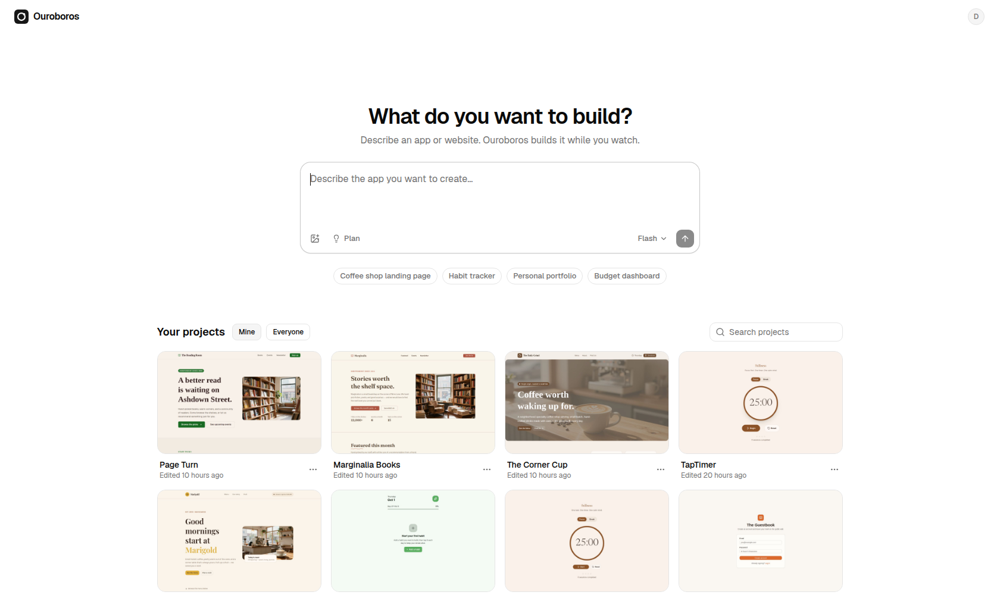
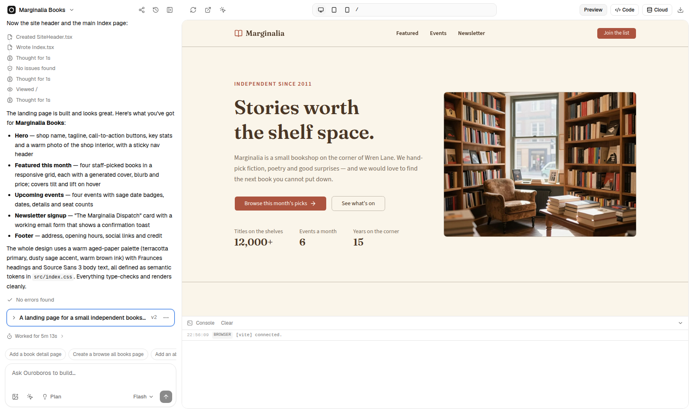

# Ouroboros

A self-hosted AI app builder in the spirit of Lovable and v0. You describe an app in chat, an agent builds it, and a live preview runs next to the chat. It runs on your own hardware against any OpenAI-compatible model endpoint.





- **Chat + live preview**: v0-style transcript (thinking, step rows, version cards, plans, clarifying questions), queued prompts, stop/retry/undo.
- **Visual edits**: select elements in the preview, then edit labels and styles directly (written back to the JSX) or ask the AI about that element.
- **Versions**: every turn is a version; restore never rewrites history; preview any old version; download any project as a standalone Vite app.
- **Backend ("Cloud")**: per-project Supabase-compatible stack (Postgres, auth, PostgREST, storage, Bun server functions). Migrations need approval in chat, secrets are entered in secure cards, and a security scan checks row-level security.
- **Self-healing**: type checks, a lint pass for real bugs, a headless-browser check (runtime errors, broken images, failed requests) and deterministic fixers run after every turn.
- **Images** (optional): generated with ComfyUI (Z-Image Turbo).

## Architecture

| Path | What |
|---|---|
| `server/` | Hono API, agent loop (OpenAI tool calling), sandbox + backend manager, preview gateway |
| `web/` | React + shadcn UI |
| `template/` | Starter app copied into every project (React, Vite, Tailwind v4, shadcn, react-router) plus `.ouroboros/` (JSX tagger + preview bridge) |
| `sandbox/Containerfile` | Node 22 + pnpm image used for every project's dev server |
| `server/backend/` | Init SQL and the Bun functions runner for project backends |

Port 8787 serves the app and API. Port 8788 is the preview gateway: `/p/<id>/` serves app previews (Vite + HMR) and `/b/<id>/{auth,rest,storage,functions}/v1` serves app backends. The gateway is a separate origin by design.

Each project gets a container running its dev server. A project's backend is a set of containers on its own network. Ouroboros drives them with **podman** (local, rootless) or **docker** (`CONTAINER_CLI`, auto-detected).

## Requirements

- Linux with **podman** or **docker**, and **Node 22+**
- An OpenAI-compatible endpoint with tool calling (LiteLLM, vLLM, llama.cpp server, Ollama…). Developed against Qwen-class ~35B models.
- Optional: ComfyUI (image generation), Chrome/Chromium (screenshots, thumbnails, runtime checks), an embeddings model
- Raise inotify limits, because every project runs a file-watching dev server: `sudo sysctl -w fs.inotify.max_user_instances=8192` (persist it in `/etc/sysctl.d/`). With a lower limit Ouroboros falls back to polling.

## Run locally

```sh
npm install
cp .env.example .env       # set AI_BASE_URL, AI_API_KEY, AI_MODELS…
npm run build && npm start # http://localhost:8787 (the sandbox image is built on first start)
```

For development, run `npm run dev:server` and `npm run dev:web` (Vite on :5173, which proxies `/api` and `/auth`). Tests: `npm test`. Type-check: `npm run typecheck`.

Locally Ouroboros starts its own Postgres container. To inspect another instance's database from a dev machine, set `DATABASE_URL` and `DB_READONLY=1`; every write then fails instead of changing that database.

**Models.** With `AI_MODELS` unset, the picker lists the endpoint's chat models and re-reads them every five minutes, so adding or retiring a model needs no change in Ouroboros; projects that used a retired model move to the default. On LiteLLM you can name them for people by adding this to a model in its config:

```yaml
model_info:
  ouroboros: { label: "Fast", description: "Quick edits", default: true }   # hidden: true hides a model
```

Without that, the model id is shown. `AI_MODELS` pins the list instead, and `AI_DEFAULT_MODEL` overrides the default.

**Per-user usage.** Set `AI_USER_HEADER` to have every model call carry the email of the person who sent the prompt in that request header (for example `X-OpenWebUI-User-Email`, which LiteLLM reads as the end user). On shared projects that is whoever prompted, not the owner. Automatic follow-up work in the same turn counts towards the same person. Nothing is sent when the variable is unset or the user has no email.

## Deploying with Docker

`Dockerfile` builds Ouroboros with the docker CLI, Chromium and git. `deploy/compose.example.yaml` runs it on a Docker host:

- The Docker socket is mounted so Ouroboros can start sibling containers, which it reaches by name on the `ouroboros` network (`CONTAINER_NETWORK`).
- The data directory must be mounted at the host path given in `HOST_DATA_DIR`, because project folders are bind-mounted into those sibling containers.
- Point `DATABASE_URL` at a Postgres you manage.
- Put a reverse proxy in front of 8787 (app) and 8788 (previews), and set `PUBLIC_URL` / `PREVIEW_URL` accordingly.

## Auth

Ouroboros chooses its auth mode from the environment (`AUTH_MODE` overrides it):

| Mode | When | Behaviour |
|---|---|---|
| `dev` | no `OIDC_ISSUER` (local development) | auto-signed-in as a local admin, no login |
| `oidc` | `OIDC_ISSUER` is set | native OpenID Connect (authorization code + PKCE), server-side sessions in Postgres, RP-initiated logout |
| `header` | `TRUSTED_PROXIES` is set | trusts forward-auth headers (`X-authentik-*`, `Remote-User`), but only from those proxy IPs |

**Roles.** A user is `admin` (sees and opens everyone's projects), `user`, or has no access. The role comes from the `ouroboros_role` claim (`OIDC_ROLE_CLAIM`). If that claim is missing, Ouroboros falls back to the `groups` claim (`OIDC_ADMIN_GROUP` / `OIDC_USER_GROUP`), and otherwise to `OIDC_DEFAULT_ROLE` (`none`). Users are identified by email. The avatar comes from the `picture` claim, when the provider sends one. Someone without access gets a "No access" page, and no account is created.

### Example: Authentik

1. Create groups `svc-ouroboros-user` and `svc-ouroboros-admin`, with `svc-ouroboros-user` as the admin group's parent.
2. Add a scope mapping named `ouroboros_role`. Authentik's `groups` claim only contains direct memberships; `ak_is_group_member` also follows inherited groups:
   ```python
   if ak_is_group_member(request.user, name="svc-ouroboros-admin"):
       return {"ouroboros_role": "admin"}
   if ak_is_group_member(request.user, name="svc-ouroboros-user"):
       return {"ouroboros_role": "user"}
   return {"ouroboros_role": "none"}
   ```
3. Create an OAuth2/OpenID provider (confidential) with:
   - redirect URI `https://<your host>/auth/callback`
   - scopes `openid email profile ouroboros_role`
   - an RS256 signing key

   Then create an application with slug `ouroboros` and bind it to `svc-ouroboros-user`.
4. Configure Ouroboros:
   ```env
   PUBLIC_URL=https://ouroboros.example.com
   OIDC_ISSUER=https://auth.example.com/application/o/ouroboros/
   OIDC_CLIENT_ID=...
   OIDC_CLIENT_SECRET=...
   SESSION_SECRET=<openssl rand -hex 32>
   ```

`deploy/authentik-blueprint.yaml` contains the same objects as a blueprint. Any other OIDC provider works the same way, as long as it issues a role or groups claim.

| Variable | Default | Purpose |
|---|---|---|
| `SESSION_HOURS` | `168` | session lifetime; the role is re-read at every sign-in |

**Previews.** The preview gateway (8788) is not behind auth, so previews can be shared. Restrict it at the network level if you need to.

## Data

`DATA_DIR` (default `./data`) holds project git repos, uploads, thumbnails and backend credentials. Container volumes hold backend databases (`ob-be-<id>-*`) and the shared pnpm store (`ouroboros-pnpm`). Deleting a project removes its sandbox, its backend containers, its network and its volumes.

## License

[MIT](LICENSE)
